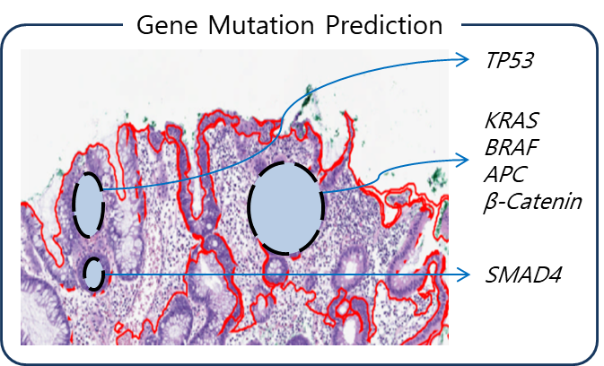

# Awesome Imaging Genetics
Recent advances in artificial intelligence (AI) has been largely reflected in radiomics, an academic area connecting the high-throughput information of images (or imaging phenotype) with clinical outcomes, such as tumor detection, secmentation or disease stages. A conventional research pipelines in radionomics were 1) data and label processing, 2) (hand-crafted)feature selection, and 3) correlation analysis between the selected features and disease biomarkers. The 2) feature selection and the 3) correlation analysis have been integrated via AI techniques, most of them employing the convolutional neural networks as the training backbone. 

Imaging genomics can be regarded as an extension to radiomics, where we attempt to predict and trace genotypic information from medical imaging phenotype, rather than tumors and diseases. While tumors and disease patterns might be quite obvious in the human eyes, genotypic information or protein expression is harder to trace from images, where the AI techniques come into play. This is an interesting research area, which is inherently interdisciplinary at the intersection of biology, biophysics, medical imaging, computer science and engineering, and perhaps more areas.      
## Imaging Genetics
Imaging Genetics, i.e., Imaging Genomics or Radiogenomics, is a rapidly evolving field connecting the cellular genomics and medical image analysis. In this document, the exact name of the research area is interchangeably referred to any one of in the three different names, until it has a standardized name agreed by scholars. It primarily concerns tracking genetic variations from the imaging phenotype. Driven by recent advances in machine learning and active application of the algorithm, a host of novel research ideas have been brought into fruition. To highlight those efforts, the long-term goal of this repository is to list relevant research papers and summarize available public datasets, with a focus on machine learning approaches.  

The figure above illustrates the intuition of Imaging Genetics. We would like to trace genetic information underlying the patterns (or phenotype) found on medical images! (Don't be misguided, I do not claim that we can trace all the genetic mutations in a colorectal tissue as in the feagure, the figure is for illustrative purpose only.) 

## Current update status
* [ ] Paper list
* [ ] More datasets
* [ ] Major datasets

## Paper list
- This paper list is partially attributable to the following papers.
  * Lee et al., [Radiomics and imaging genomics in precision medicine](https://www.pfmjournal.org/journal/view.php?number=9), *Precision and Future Medicine*, 2017
  * Bai et al., [Imaging genomics in cancer research: limitations and promises](https://www.ncbi.nlm.nih.gov/pubmed/26864054), *The British Journal of Radiology*, 2016
  * Bogdan et al., [Imaging Genetics and Genomics in Psychiatry: A Critical Review of Progress and Potential](https://www.ncbi.nlm.nih.gov/pubmed/28283186), *Biological Psychiatry*, 2017

* Imaging Genomics (Radiogenomics, Imaging Genetics) - Convention
  * Halpenny et al., [Radiogenomic evaluation of lung cancer: are there imaging characteristics associated with lung adenocarcinomas harboring BRAF mutations?](https://www.ncbi.nlm.nih.gov/pubmed/28012356), *Clinical Imaging*, 2017
  * Demerath et al., [Mesoscopic imaging of glioblastomas: Are diffusion, perfusion and spectroscopic measures influenced by the radiogenetic phenotype?](https://www.ncbi.nlm.nih.gov/pubmed/27864578), *The Neuroradiology Journal*, 2016
  * Wiestler et al., [Multiparametric MRI-based differentiation of WHO grade II/III glioma and WHO grade IV glioblastoma](https://www.ncbi.nlm.nih.gov/pubmed/27739434), *Scientific Reports*, 2016
  * Heiland et al., [Molecular differences between cerebral blood volume and vessel size in glioblastoma multiforme](https://www.ncbi.nlm.nih.gov/pubmed/27613830), *Oncotarget*, 2016
  * Hu et al., [Radiogenomics to characterize regional genetic heterogeneity in glioblastoma](https://www.ncbi.nlm.nih.gov/pubmed/27502248), *Neuro-Oncology*, 201
  * Saha et al., [Interobserver variability in identification of breast tumors in MRI and its implications for prognostic biomarkers and radiogenomics](https://www.ncbi.nlm.nih.gov/pubmed/27487872), *Medical Physics*, 2016
  * Mehta et al., [Radiogenomics monitoring in breast cancer identifies metabolism and immune checkpoints as early actionable mechanisms of resistance to anti-angiogenic treatment](https://www.ncbi.nlm.nih.gov/pubmed/27474395), *EBioMedicine*, 2016
  * Stoyanova et al., [Association of multiparametric MRI quantitative imaging features with prostate cancer gene expression in MRI-targeted prostate biopsies](https://www.ncbi.nlm.nih.gov/pubmed/27438142), *Oncotarget*, 2016
  * Zhao et al., [Reproducibility of radiomics for deciphering tumor phenotype with imaging](https://www.ncbi.nlm.nih.gov/pubmed/27009765), *Scientific Reports*, 2016
  * McCann et al., [Quantitative multiparametric MRI features and PTEN expression of peripheral zone prostate cancer: a pilot study](https://www.ncbi.nlm.nih.gov/pubmed/27009765), *American Journal of Roentgenology*, 2016
  * Guo et al., [Prediction of clinical phenotypes in invasive breast carcinomas from the integration of radiomics and genomics data](https://www.ncbi.nlm.nih.gov/pubmed/26835491), *Journal of Medical Imaging*, 2016
  * Zhu et al., [Deciphering genomic underpinnings of quantitative MRI-based radiomic phenotypes of invasive breast carcinoma](https://www.nature.com/articles/srep17787), *Scientific Reports*, 2015
  * Kickingereder et al., [IDH mutation status is associated with a distinct hypoxia/angiogenesis transcriptome signature which is non-invasively predictable with rCBV imaging in human glioma](https://www.ncbi.nlm.nih.gov/pubmed/26538165), *Scientific Reports*, 2015
  * Rao et al., [A combinatorial radiographic phenotype may stratify patient survival and be associated with invasion and proliferation characteristics in glioblastoma](https://www.ncbi.nlm.nih.gov/pubmed/26473782), *Journal of Neurosurgery*, 2016
  * Gutman et al., [Somatic mutations associated with MRI-derived volumetric features in glioblastoma](https://www.ncbi.nlm.nih.gov/pubmed/26337765), *Neuroradiology*, 2015
  * Renard-Penna et al., [Multiparametric magnetic resonance imaging predicts postoperative pathology but misses aggressive prostate cancers as assessed by cell cycle progression score](https://www.ncbi.nlm.nih.gov/pubmed/26272031), *Journal of Urology*, 2015
  * Shinagare et al., [Radiogenomics of clear cell renal cell carcinoma: preliminary findings of The Cancer Genome Atlas-Renal Cell Carcinoma (TCGA-RCC) Imaging Research Group](https://www.ncbi.nlm.nih.gov/pubmed/25753955), *Abdominal Radiology*, 2015
  * Wang et al., [Anatomical localization of isocitrate dehydrogenase 1 mutation: a voxel-based radiographic study of 146 low-grade gliomas](https://www.ncbi.nlm.nih.gov/pubmed/25318355), *European Journal of Neurology*, 2015
  * Halpenny et al., [Are there imaging characteristics associated with lung adenocarcinomas harboring ALK rearrangements?](https://www.ncbi.nlm.nih.gov/pubmed/25312988), *Lung Cancer*, 2014
  * Gevaert et al., [Glioblastoma multiforme: exploratory radiogenomic analysis by using quantitative image features](https://www.ncbi.nlm.nih.gov/pubmed/24827998), *Radiology*, 2014
  * Nair et al., [NF- kappaB protein expression associates with (18)F-FDG PET tumor uptake in non-small cell lung cancer: a radiogenomics validation study to understand tumor metabolism](https://www.ncbi.nlm.nih.gov/pubmed/24355259), *Lung Cancer*, 2014
  * Jamshidi et al., [Illuminating radiogenomic characteristics of glioblastoma multiforme through integration of MR imaging, messenger RNA expression, and DNA copy number variation](https://www.ncbi.nlm.nih.gov/pubmed/24056404), *Radiology*, 2014
  * Karlo et al., [Radiogenomics of clear cell renal cell carcinoma: associations between CT imaging features and mutations](https://www.ncbi.nlm.nih.gov/pubmed/24029645), *Radiology*, 2014
  * De Ruysscher et al., [Quantification of radiation-induced lung damage with CT scans: the possible benefit for radiogenomics](https://www.ncbi.nlm.nih.gov/pubmed/23957564), *Acta Oncologica*, 2013
  * Zinn et al., [Radiogenomic mapping of edema/cellular invasion MRI-phenotypes in glioblastoma multiforme](https://www.ncbi.nlm.nih.gov/pubmed/21998659), *PLoS One*, 2011
  * Gevaert et al., [Non-small cell lung cancer: identifying prognostic imaging biomarkers by leveraging public gene expression microarray data: methods and preliminary results](https://www.ncbi.nlm.nih.gov/pubmed/22723499), *Radiology*, 2012
  * Aerts et al., [Decoding tumour phenotype by noninvasive imaging using a quantitative radiomics approach](https://www.nature.com/articles/ncomms5006), *Nature Communications*, 2014
  * Kuo et al., [Radiogenomic analysis to identify imaging phenotypes associated with drug response gene expression programs in hepatocellular carcinoma](https://www.ncbi.nlm.nih.gov/pubmed/17609439), *Journal of Vascular and Interventional Radiology*, 2007
  * Nair et al., [Prognostic PET 18F-FDG uptake imaging features are associated with major oncogenomic alterations in patients with resected non-small cell lung cancer](https://www.ncbi.nlm.nih.gov/pubmed/22710433), *Cancer Research*, 2012
  * Segal et al., [Decoding global gene expression programs in liver cancer by noninvasive imaging](https://www.nature.com/articles/nbt1306), *Nature Biotechnology*, 2007
  * Yamamoto et al., [Radiogenomic analysis of breast cancer using MRI: a preliminary study to define the landscape](https://www.ncbi.nlm.nih.gov/pubmed/22915408), *American Journal of Roentgenology*, 2012
  * Yamamoto et al., [Breast cancer: radiogenomic biomarker reveals associations among dynamic contrast-enhanced MR imaging, long noncoding RNA, and metastasis](https://www.ncbi.nlm.nih.gov/pubmed/25734557), *Radiology*, 2015
  * Barajas et al., [Glioblastoma multiforme regional genetic and cellular expression patterns: influence on anatomic and physiologic MR imaging](https://www.ncbi.nlm.nih.gov/pubmed/20093527), *Radiology*, 2010
  * Diehn et al., [Identification of noninvasive imaging surrogates for brain tumor gene-expression modules](https://www.ncbi.nlm.nih.gov/pubmed/18362333), *PNAS*, 2008
  * Pope et al., [Relationship between gene expression and enhancement in glioblastoma multiforme: exploratory DNA microarray analysis](https://www.ncbi.nlm.nih.gov/pubmed/18796682), *Radiology*, 2008
  * Zinn et al., [A novel volume-age-KPS (VAK) glioblastoma classification identifies a prognostic cognate microRNA-gene signature](https://www.ncbi.nlm.nih.gov/pubmed/22870228), *PLoS One*, 2012
  * Jamshidi et al., [The radiogenomic risk score: construction of a prognostic quantitative, noninvasive imagebased molecular assay for renal cell carcinoma](https://www.ncbi.nlm.nih.gov/pubmed/26402495), *Radiology*, 2015
  * Colen et al., [NCI Workshop Report: clinical and computational requirements for correlating imaging phenotypes with genomics signatures](https://www.ncbi.nlm.nih.gov/pubmed/25389451), *Translational Oncology*, 2014
  * Carlson et al., [Relationship between survival and edema in malignant gliomas: role of vascular endothelial growth factor and neuronal pentraxin 2](https://www.ncbi.nlm.nih.gov/pubmed/17473188), *Clinical Cancer Research*, 2007
  * Colen et al., [TCGA Glioma Phenotype Research Group. Imaging genomic mapping of an invasive MRI phenotype predicts patient outcome and metabolic dysfunction: a TCGA glioma phenotype research group project](https://www.ncbi.nlm.nih.gov/pubmed/24889866), *BMC Medical Genomics*, 2014
  * Jain et al., [Correlation of perfusion parameters with genes related to angiogenesis regulation in glioblastoma: a feasibility study](https://www.ncbi.nlm.nih.gov/pubmed/22422183), *American Journal of Neuroradiology*, 2012
  * Naeini et al., [Identifying the mesenchymal molecular subtype of glioblastoma using quantitative volumetric analysis of anatomic magnetic resonance images](https://www.ncbi.nlm.nih.gov/pubmed/23444259), *Neuro-Oncology*, 2013
  * Nicolasjilwan et al., [TCGA Glioma Phenotype Research Group. Addition of MR imaging features and genetic biomarkers strengthens glioblastoma survival prediction in TCGA patients](https://www.ncbi.nlm.nih.gov/pubmed/24997477), *Journal of Neuroradiology*, 2015
  * Pope et al., [Non-invasive detection of 2-hydroxyglutarate and other metabolites in IDH1 mutant glioma patients using magnetic resonance spectroscopy](https://www.ncbi.nlm.nih.gov/pubmed/22015945), *Journal of Neuro-Oncology*, 2012
  * Osborne et al., [18F-FDG PET of locally invasive breast cancer and association of estrogen receptor status with standardized uptake value: microarray and immunohistochemical analysis](https://www.ncbi.nlm.nih.gov/pmc/articles/PMC4141648/), *Journal of Nuclear Medicine*, 2010
  * Palaskas et al., [18F-fluorodeoxy-glucose positron emission tomography marks MYC-overexpressing human basal-like breast cancers](), *Cancer Research*, 2011
  * Zhu et al., [Brain metastasis in children with stage 4 neuroblastoma after multidisciplinary treatment](https://www.ncbi.nlm.nih.gov/pmc/articles/PMC4593360/), *Chinese Journal of Cancer*, 2015
  * Miura et al., [Distinct clinicopathological phenotype of hepatocellular carcinoma with ethoxybenzylmagnetic resonance imaging hyperintensity: association with gene expression signature](https://www.ncbi.nlm.nih.gov/pubmed/26105803), *The American Journal of Surgery*, 2015
  * Halle et al., [Hypoxiainduced gene expression in chemoradioresistant cervical cancer revealed by dynamic contrast-enhanced MRI](https://www.ncbi.nlm.nih.gov/pubmed/22890239), *Cancer Research*, 2012<!---from here may be classified as semi-radiogenomic approach-->
  * Halpenny et al., [Are there imaging characteristics associated with lung adenocarcinomas harboring ALK rearrangements?](https://www.ncbi.nlm.nih.gov/pubmed/25312988), *Lung Cancer*, 2014
  * Mazurowski et al., [Radiogenomic analysis of breast cancer: luminal B molecular subtype is associated with enhancement dynamics at MR imaging](https://www.ncbi.nlm.nih.gov/pubmed/25028781), *Radiology*, 2014
  * Gutman et al., [MR imaging predictors of molecular profile and survival: multi-institutional study of the TCGA glioblastoma data set](), *Radiology*, 2013
  * Gutman et al., [Somatic mutations associated with MRI-derived volumetric features in glioblastoma](https://www.ncbi.nlm.nih.gov/pubmed/26337765), *Neuroradiology*, 2015
  * Banerjee et al., [A computed tomography radiogenomic biomarker predicts microvascular invasion and clinical outcomes in hepatocellular carcinoma](https://www.ncbi.nlm.nih.gov/pubmed/25930992), *Hepatology*, 2015
  * Carrillo et al., [Relationship between tumor enhancement, edema, IDH1 mutational status, MGMT promoter methylation, and survival in glioblastoma](https://www.ncbi.nlm.nih.gov/pubmed/22322613), *American Journal of Neuroradiology*, 2012
  * Drabycz et al., [An analysis of image texture, tumor location, and MGMT promoter methylation in glioblastoma using magnetic resonance imaging](https://www.ncbi.nlm.nih.gov/pubmed/19796694), *Neuroimage*, 2009
  * Moon et al., [Imaging parameters of high grade gliomas in relation to the MGMT promoter methylation status: the CT, diffusion tensor imaging, and perfusion MR imaging](https://www.ncbi.nlm.nih.gov/pubmed/21833736), *Neuroradiology*, 2011
  * Aghi et al., [Magnetic resonance imaging characteristics predict epidermal growth factor receptor amplification status in glioblastoma](https://www.ncbi.nlm.nih.gov/pubmed/16361543), *Clinical Cancer Research*, 2005
  * Ellingson et al., [Probabilistic radiographic atlas of glioblastoma phenotypes](https://www.ncbi.nlm.nih.gov/pubmed/22997168), *American Journal of Neuroradiology*, 2013
  * Gupta et al., [Pretreatment Dynamic Susceptibility Contrast MRI Perfusion in Glioblastoma: Prediction of EGFR Gene Amplification](https://www.ncbi.nlm.nih.gov/pubmed/24474262), *Clinical Neuroradiology*, 2015
  * Jain et al., [Genomic mapping and survival prediction in glioblastoma: molecular subclassification strengthened by hemodynamic imaging biomarkers](https://www.ncbi.nlm.nih.gov/pubmed/23238158), *Radiology*, 2013
  * Lanic et al., [Interim positron emission tomography scan associated with international prognostic index and germinal center B cell-like signature as prognostic index in diffuse large B-cell lymphoma](https://www.ncbi.nlm.nih.gov/pubmed/21806349), *Leukemia & Lymphoma*, 2012
  * Miles et al., [Multifunctional imaging signature for V-KI-RAS2 Kirsten rat sarcoma viral oncogene homolog (KRAS) mutations in colorectal cancer](https://www.ncbi.nlm.nih.gov/pubmed/24516257), *Journal of Nuclear Medicine*, 2014
  * Ashraf et al., [Identification of intrinsic imaging phenotypes for breast cancer tumors: preliminary associations with gene expression profiles](https://www.ncbi.nlm.nih.gov/pubmed/24702725), *Radiology*, 2014
  * Li et al., [Pilot study demonstrating potential association between breast cancer image-based risk phenotypes and genomic biomarkers](https://www.ncbi.nlm.nih.gov/pubmed/24593735), *Medical Physics*, 2014
  * Rizzo et al., [CT Radiogenomic Characterization of EGFR, K-RAS, and ALK Mutations in Non-Small Cell Lung Cancer](https://www.ncbi.nlm.nih.gov/pubmed/25956936), *European Radiology*, 2016
  * Izuishi et al., [Molecular mechanism underlying the detection of colorectal cancer by 18F-2-fluoro-2-deoxy-D-glucose positron emission tomography](https://www.ncbi.nlm.nih.gov/pubmed/22065316), *Journal of Gastrointestinal Surgery*, 2012
  * Lee et al., [Relationship Between 18F-Fluorodeoxyglucose Uptake and V-Ki-Ras2 Kirsten Rat Sarcoma Viral Oncogene Homolog Mutation in Colorectal Cancer Patients: Variability Depending on C-Reactive Protein Level](https://www.ncbi.nlm.nih.gov/pubmed/26735530), *Medicine (Baltimore)*, 2016
  * Kawada et al., [Relationship between 18F-fluorodeoxyglucose accumulation and KRAS/BRAF mutations in colorectal cancer.](https://www.ncbi.nlm.nih.gov/pubmed/22282467), *Clinical Cancer Research*, 2012
  * Tykocinski et al., [Use of magnetic perfusion-weighted imaging to determine epidermal growth factor receptor variant III expression in glioblastoma](https://www.ncbi.nlm.nih.gov/pubmed/22492960), *Neuro-Oncology*, 2012
  * Kong et al., [Diagnostic dilemma of pseudoprogression in the treatment of newly diagnosed glioblastomas: the role of assessing relative cerebral blood flow volume and oxygen-6-methylguanine-DNA methyltransferase promoter methylation status](https://www.ncbi.nlm.nih.gov/pubmed/21252041), *American Journal of Neuroradiology*, 2011
  * Romano et al., [Apparent diffusion coefficient obtained by magnetic resonance imaging as a prognostic marker in glioblastomas: correlation with MGMT promoter methylation status](https://www.ncbi.nlm.nih.gov/pubmed/22875158), *European Radiology*, 2013
  * Sunwoo et al., [Correlation of apparent diffusion coefficient values measured by diffusion MRI and MGMT promoter methylation semiquantitatively analyzed with MS-MLPA in patients with glioblastoma multiforme](https://www.ncbi.nlm.nih.gov/pubmed/23023975), *Journal of Magnetic Resonance Imaging*, 2013
  * Ahn et al., [Prediction of methylguanine methyltransferase promoter methylation in glioblastoma using dynamic contrast-enhanced magnetic resonance and diffusion tensor imaging](https://www.ncbi.nlm.nih.gov/pubmed/24949678), *Journal of Neurosurgery*, 2014
  * Sutton et al., [Breast cancer subtype intertumor heterogeneity: MRI-based features predict results of a genomic assay](https://www.ncbi.nlm.nih.gov/pubmed/25850931), *Journal of Magnetic Resonance Imaging*, 2015
  * Kitao et al., [Hepatocellular carcinoma: signal intensity at gadoxetic acid-enhanced MR Imaging--correlation with molecular transporters and histopathologic features](https://www.ncbi.nlm.nih.gov/pubmed/20663969), *Radiology*, 2010
  * Lee et al., [Epidermal growth factor receptor mutation in lung adenocarcinomas: relationship with CT characteristics and histologic subtypes](https://www.ncbi.nlm.nih.gov/pubmed/23468578), *Radiology*, 2013
  * Glynn et al., [Are There Imaging Characteristics Associated with Epidermal Growth Factor Receptor and KRAS Mutations in Patients with Adenocarcinoma of the Lung with Bronchioloalveolar Features?](https://www.jto.org/article/S1556-0864(15)32307-8/abstract), *Journal of Thoracic Oncology*, 2010
  * Plodkowski et al., [From genotype to phenotype: Are there imaging characteristics associated with lung adenocarcinomas harboring RET and ROS1 rearrangements?](https://www.ncbi.nlm.nih.gov/pubmed/26424208), *Lung Cancer*, 2015
  * Ozkan et al., [CT Gray-Level Texture Analysis as a Quantitative Imaging Biomarker of Epidermal Growth Factor Receptor Mutation Status in Adenocarcinoma of the Lung](https://www.ncbi.nlm.nih.gov/pubmed/26496549), *American Journal of Roentgenology*, 2015
  * Yoon et al., [Decoding Tumor Phenotypes for ALK, ROS1, and RET Fusions in Lung Adenocarcinoma Using a Radiomics Approach](https://www.ncbi.nlm.nih.gov/pubmed/26469915), *Medicine (Baltimore)*, 2015
  * Adhikari et al., [Heritability estimates on resting state fMRI data using ENIGMA analysis pipeline](https://www.ncbi.nlm.nih.gov/pubmed/29218892), *Pacific Symposium on Biocomputing*, 2018
  * Miller et al., [Codon bias among synonymous rare variants is associated with Alzheimer's disease imaging biomarker](https://www.ncbi.nlm.nih.gov/pubmed/29218897), *Pacific Symposium on Biocomputing*, 2018
  * Srivastava et al., [Building trans-omics evidence: using imaging and 'omics' to characterize cancer profiles](https://www.ncbi.nlm.nih.gov/pubmed/29218898), *Pacific Symposium on Biocomputing*, 2018
  *  et al., , **, 20
  *  et al., , **, 20
  *  et al., , **, 20
  

* Imaging Genomics (Radiogenomics, Imaging Genetics) - Machine Learning
  * Kickingereder et al., [Radiogenomics of glioblastoma: machine learning-based classification of molecular characteristics by using multiparametric and multiregional MR imaging features](https://pubs.rsna.org/doi/10.1148/radiol.2016161382), *Radiology*, 2016  
  * Macyszyn et al., [Imaging patterns predict patient survival and molecular subtype in glioblastoma via machine learning techniques](https://www.ncbi.nlm.nih.gov/pubmed/26188015), *Neuro-Oncology*, 2015
  * Pearlson et al., [An introductory review of parallel independent component analysis (p-ICA) and a guide to applying p-ICA to genetic data and imaging phenotypes to identify disease-associated biological pathways and systems in common complex disorders](https://www.ncbi.nlm.nih.gov/pubmed/26442095), *Frontiers in genetics*, 2015
  * Eric et al., [Imaging Genetics Via Sparse Canonical Correlation Analysis](https://www.ncbi.nlm.nih.gov/pmc/articles/PMC3892670/), *IEEE International Symposium on Biomedical Imaging*, 2013
  * Le Floch et al., [ Significant correlation
between a set of genetic polymorphisms and a functional brain network revealed by feature
selection and sparse Partial Least Squares](https://www.ncbi.nlm.nih.gov/pubmed/22781162), *Neuroimage*, 2012
  * Vounou et al., [Discovering genetic associations with high-dimensional neuroimaging phenotypes: A sparse reduced-rank regression approach](https://www.ncbi.nlm.nih.gov/pubmed/20624472), *Neuroimage*, 2010
  * Chen et al., [Guided exploration of genomic risk for gray matter abnormalities in schizophrenia using parallel independent component analysis with reference](https://www.ncbi.nlm.nih.gov/pubmed/23727316), *Neuroimage*, 2013
  * Hinrichs et al., [Predictive markers for AD in a multi-modality framework: an analysis of MCI progression in the ADNI population](https://www.ncbi.nlm.nih.gov/pubmed/21146621), *Neuroimage*, 2011
  * Honghui et al., [A Hybrid Machine Learning Method for Fusing fMRI and Genetic Data: Combining both Improves Classification of Schizophrenia](https://www.ncbi.nlm.nih.gov/pmc/articles/PMC2990459/), *Frontiers in Human Neuroscience*, 2010
  * Arnedo et al., [Uncovering the hidden risk architecture of the schizophrenias: confirmation in three independent genome-wide association studies](https://www.ncbi.nlm.nih.gov/pubmed/25219520), *The American journal of
psychiatry*, 2015
  * Coudray et al., [Classification and mutation prediction from non–small cell lung cancer histopathology images using deep learning](https://www.nature.com/articles/s41591-018-0177-5), *Nature Medicine*, 2018
  * Borkowski et al., [Apple Machine Learning Algorithms Successfully Detect Colon Cancer but Fail to Predict KRAS Mutation Status](https://arxiv.org/abs/1812.04660), *Arxiv Pre-print*, 2018
  * Chidester et al., [Discriminative bag-of-cells for imaging-genomics](https://www.ncbi.nlm.nih.gov/pubmed/29218893), *Pacific Symposium on Biocomputing*, 2018
  * Han and Kamdar., [MRI to MGMT: predicting methylation status in glioblastoma patients using
convolutional recurrent neural networks](https://www.ncbi.nlm.nih.gov/pubmed/29218894), *Pacific Symposium on Biocomputing*, 2018
  * Huang et al., [Deep Integrative Analysis for Survival Prediction](https://www.ncbi.nlm.nih.gov/pubmed/29218895), *Pacific Symposium on Biocomputing*, 2018
  * Huo et al., [Genotype-phenotype association study via new multi-task learning model](https://www.ncbi.nlm.nih.gov/pubmed/29218896), *Pacific Symposium on Biocomputing*, 2018
## Datasets
Datasets are perhaps the pre-requisites for any research studies in this area, where we need 1)large-scale imaging data, 2) paired with genotypic information. Here we review some rich publicly available datasets.

### \[1\] The Cancer Genomic Atlas ([TCGA](https://cancergenome.nih.gov/abouttcga/overview)) - lung adenocarcinoma (LUAD)
### \[2\] The Cancer Genomic Atlas ([TCGA](https://cancergenome.nih.gov/abouttcga/overview)) - lung adenocarcinoma (LUAD)
### \[3\] The Cancer Genomic Atlas ([TCGA](https://cancergenome.nih.gov/abouttcga/overview)) - lung adenocarcinoma (LUAD)
### \[4\] The Cancer Genomic Atlas ([TCGA](https://cancergenome.nih.gov/abouttcga/overview)) - lung adenocarcinoma (LUAD)

